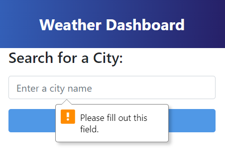

# server-side-api-weather-dashboard
Challenge 8 of edX Boot Camp (Front End) to create a Weather Dashboard.

## Description

For Weekly Challenge 8 of the edX Bootcamp Front End Course, I was given a task of writing code to create a Weather Dashboard
for a traveller who would like to see the weather outlook for multiple cities.

> What was my motivation?

My motivation was to accelerate my front end skills in web development so I can successsfully secure a web development job. 
I am building on my skills and each week I'm growing from strength to strength and want to achieve top grades throughout 
all the exercises.

>Why I built this project?

Building the website helped me to bridge the gap between theoretical knowledge and practical of applying
my Server Side API. Javascript, jQuery and Day.js library knowledge that I learnt in Week 8.

> What problem did it solve?

It solved the problem of providing a traveller to see the weather outlook for multiple cities
and helping them plan their trip accordingly.

> What did I learn?

I learnt how to use WebAPI coding and use of Open Weather Map API, and further built up my Javascript and jQuery skills to write code that is clean, readable, with comments and is maintainable.  I learnt how to use query parameters.

> What makes my project stand out? 

It stands out as I have successfully completed the exercise, used good programming practice in terms of writing clean code.
I have used appropriate constants and variables that are understandable. There are comments throughout the code so it can be understood by any developer.  

The first time a city is searched for then 2 * API calls are made to the Open Weather Map API, then I'm storing the latitude
and longitude in the attributes of the buttons so if that city is clicked on then only 1 API call is made to get the weather information.

Data is stored for the location and their latitude and longitude detals. This is also retrieved from local storage and application
updated accordingly.

Validation added so if the city does not exist then an alert message is displayed. Also, validation has been added so that 
data is only parsed if valid data structures exist. 

The project has been structured so that it is loosely coupled, there is a separation of concern so every function does one thing
and does it well.

There is a hover colouring when user hovers over the buttons.

Lastly, I even created a favi icon as well !

I have pushed myself continually ensuring my work is of the highest quality. The code is readable and maintainable. 

> Technologies Used

* HTML
* Web API calls from Open Weather Map
* Javascript
* jQuery
* Day.js Library

> Tools Used

* Microsoft Windows 11
* Visual Studio Code
* Git and GitBash
* Git Lab
* Git Hub
* Slack
* Google Chrome Browser
* Notepad
* Windows File Explorer
* Microsoft Paint

## Installation

The GitHub repository for my Server Side API: Weather Dashboard can be found at: 
https://github.com/timsbootcamp/server-side-api-weather-dashboard

The source code can be cloned from the above link. 

## Usage

Link to my GitHub Repository: https://github.com/timsbootcamp/server-side-api-weather-dashboard

Link to deployed site of my solution to Week 8 : Server Side API: Weather Dashboard : 
https://timsbootcamp.github.io/server-side-api-weather-dashboard/

Screenshot - When application first runs :

Screenshot - Validation message displayed if no city has been entered and user clicks on Search button :

Screenshot - User enters London in search and clicks OK, it displays weather data for London :

Screenshot - User enters Barbados in search and clicks OK, it displays weather data for Barbados :

Screenshot - Validation message displayed if city does not exist :

Screenshot - Hover over effect on buttons :

## Credits

The URLSearchParams API
https://jscurious.com/the-urlsearchparams-api/

Favi Icon
https://icon-icons.com/download/226608/ICO/512/

